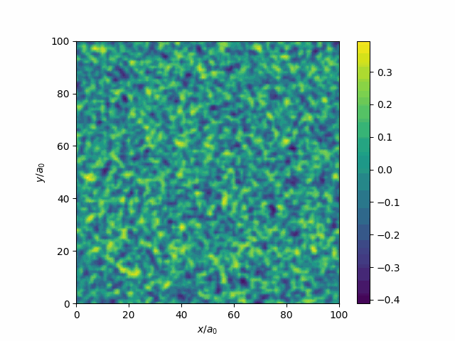
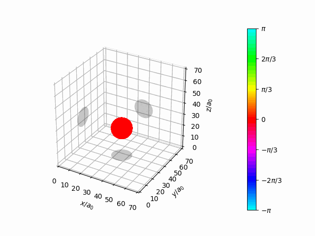

#  ComFiT: a python library for computational field theory with topological defects

ComFiT is an open-source Python library for simulating field theories including the Schrödinger equation, damped Gross-Pitaevskii equation, phase-field crystal models, and hydrodynamic models for active nematics.
It uses an object-oriented approach to provide functions for system setup, time evolution, data analysis, and visualization.
The library features the Exponential Time Differencing method for numerical integration, specifically the ETD2RK and ETD4RK schemes, ensuring accurate time evolution in simulations.

Additionally, ComFiT includes tools for tracking and calculating the density of topological defects in various systems.
It also enables users to create and export plots and animations for a clearer understanding of the simulated phenomena.

[](https://comfitlib.com)


If you use ComFiT in your research or education, please cite the following paper:

---

(submitted) Skogvoll & Rønning, (2024). ComFiT: python library for computational field theory with topological defects. Journal of Open Source Software, X(XX), XXX, [link](link)

---



*Figure: Quenching of a disordered state in a Landau system.* A 2D simulation of an order parameter (field) in a Landau model with a disordered initial condition. The equilibrium value of the order parameter is non-zero, so as the system relaxes, it spontaneously forms interfaces between regions of different order parameter values.



*Figure: Oscillating 3D Gaussian wave packet in a harmonic oscillator.* A 3D simulation of the Schrödinger equation with a Gaussian initial condition (at rest) in a Harmonic oscillator potential.
The amplitude of the wavefunction is shown as an isosurface at $50\%$ its maximal value and the argument by the angle color scheme of the figure above.

## Documentation

For detailed usage instructions, tutorials and instructions on how to contribute, please refer to our [documentation](https://comfitlib.com).

## Installation

Comfit can be installed from the Python Package Index (PyPI), a repository of software for the Python programming language, by executing the command

```bash
pip install comfit
```

## License

ComFiT is licensed under the [MIT License](LICENSE).

## Acknowledgments

We are grateful to [Luiza Angheluta](https://orcid.org/0000-0001-7231-6694) for her steady guidance during our years as Ph.D. doctoral research fellows and for introducing us to this field of study,
[Audun Skaugen](https://orcid.org/0000-0003-0005-786X) for paving the way for the study of these systems in particular and creating the first programs on which this library is built, and
[Vegard Gjeldvik Jervell](https://orcid.org/0009-0002-2959-0246), for helping us with the technical python parts and becoming full-fledged software developers.
