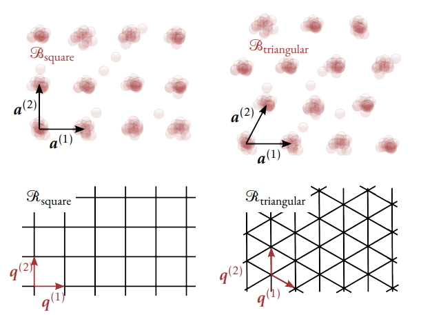
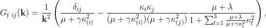
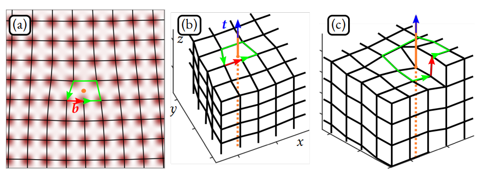

# Phase Field Crystal

## Basic model

The phase-field crystal methodology is based on postulating a free
energy

$$
\mathcal F = \int d\boldsymbol{r} \tilde f(\psi, \nabla \psi, ...),
$$

with the goal of the state that minimizes $\mathcal F$ has a certain
symmetry. In this documentation, we will present six such models to
represent different crystalline structures in 1, 2 and 3 dimensions, all
of which are on the form

$$
\tilde f( \psi, \nabla \psi, ...) = \frac{1}{2} (\mathcal L(\nabla) \psi)^2 + \frac{1}{2} \texttt{r} \psi^2 + \frac{1}{3} \texttt{t} \psi^3 + \frac{1}{4} \texttt v \psi^4,
$$

where $\mathcal L (\nabla)$ is a gradient operator dependent on the
dimension and target symmetry, listed below
|Model| Derivative operator $\mathcal L$|
|-----|---------------------------------|
1D periodic       |$\mathcal L_1 = (1+\nabla^2)$
2D triangular     |$\mathcal L_1 = (1+\nabla^2)$
2D square         |$\mathcal L_1 \mathcal L_2 = (1+\nabla^2) (2+\nabla^2)$
3D bcc            |$\mathcal L_1 = (1+\nabla^2)$
3D fcc            |$\mathcal L_1 \mathcal L_{4/3} = (1+\nabla^2) (4/3+\nabla^2)$
3D simple cubic   |$\mathcal L_1 \mathcal L_2 \mathcal L_3 = (1+\nabla^2) (2+\nabla^2) (3+\nabla^2)$

*Table:* Phase-field crystal models. $\mathcal L_X = (X+\nabla^2)$.


Default values of parameters are $\texttt r=\texttt v = 1$,
$\texttt t=0$.

Historical context: model presented in Ref.
[@elderModelingElasticPlastic2004](References.md).

The primary field is $\psi$, a real valued field

```python
pfc.psi 
```

## Crystal symmetry

This field has the symmetry of a specific lattice, given by a Bravais
lattice, and the simulation domain is fitted to pack an exact number of
these peaks and throughs. Six such symmetries are implemented in the
code, which are given by the primary Bravais lattice vectors (BLVs),
which define the lattice, see this figure


*PFC Bravais and reciprocal lattice vectors: *Bravais lattices $\mathcal B$ and their reciprocal lattices $\mathcal R$ for square and triangular symmetry. 
In each case, $\{\vec a^{(n)}\}_{n=1}^2$ are primitive lattice vectors and $\{ \vec q^{(n)}\}_{n=1}^2$ primitive reciprocal lattice vectors that satisfy $\vec a^{(n)} \cdot \vec q^{(m)} = 2\pi \delta_{nm}$.
Amended and reprinted from Ref. [skogvollSymmetryTopologyCrystal2023](References.md) with permission. 

The structure can alternatively be expressed in terms of the reciprocal
lattice vectors (RLVs), which are generated by two *primitive* RLVs
$\lbrace\boldsymbol{q}^{(n)}\rbrace_{n=1}^d$, satisfying

---
$$\boldsymbol{q}^{(n)} \cdot \boldsymbol{a}^{(m)} = 2\pi \delta_{nm}, \quad n,m \leq d$$
The primitive BLV-RLV orthogonality relation.

---

There are infinitely many BLVs and RLVs, but of particular interest are
those with the smallest magnitude; which are sometimes named *primary*
RLVs/BLVs.

These values are encoded in the instance properties `a,q`, e.g.,
```python
import comfit as cf

pfc = cf.PFCtri(1,1)
print(pfc.a)
print(pfc.q)
>> 
[[3.627, 6.283], [7.255, 0.0], [3.627, -6.283]]
[[0, 1], [0.866, -0.5], [-0.866, -0.5]]
```

---
Note the subtle difference between a *primitive* LV and a *primary* LV.
The primitive BLVs generate the lattice and satisfy the orthogonal
relationship with the primitive RLVs which generate the reciprocal
lattice. There are only $d$ primitive LVs in $d$ dimensions whereas
there may be any number of primary lattice vectors. For instance, there
are six primitive BLVs for the triangular lattice and four primitive
lattice vectors for the 2D square lattice. In the following, the primary BLVs and RLVs have
been chosen so that the first $d$ primary LVs are primitive LVs which satisfy the orthogonality relation.

---


### 1D periodic

Lattice constant

$$
a_0 = 2\pi
$$

Primary RLVs

$$
\mathcal R_{\textrm{per}}^{(1)} = 
\left \lbrace 
\begin{array}{l}
    q^{(1)} = 1  \\
    q^{(-1)}= - q^{(1)} 
\end{array}
\right \rbrace
$$ 

Primary BLVs

$$
\mathcal B_{\textrm{per}}^{(1)} = 
\left \lbrace 
\begin{array}{l}
    a^{(1)} = a_0  \\
    a^{(-1)} = -\mathbf a^{(1)} 
\end{array}
\right \rbrace 
$$


### 2D Triangular

Lattice constant

$$
a_0 = \frac{4\pi}{\sqrt 3}
$$

Primary RLVs

$$ 
\mathcal R_{\textrm{tri}}^{(1)} = {
\left \lbrace 
\begin{array}{l}
    \mathbf q^{(1)} = (\sqrt 3/2,-1/2)  \\
    \mathbf q^{(2)} = (0,1) \\
    \mathbf q^{(3)} = (-\sqrt 3/2,-1/2) \\ 
    \mathbf q^{(-n)} = - \mathbf q^{(n)}|_{n=1,2,3} \\
\end{array}
\right \rbrace
}
$$

Primary BLVs

$$
\mathcal B_{\textrm{tri}}^{(1)} = {
\left \lbrace 
\begin{array}{l}
    \mathbf a^{(1)} = a_0(1,0)  \\
    \mathbf a^{(2)} = a_0(1/2,\sqrt 3/2) \\
    \mathbf a^{(3)} = a_0(1/2,-\sqrt 3/2) \\ 
    \mathbf a^{(-n)}=-\mathbf a^{(n)}|_{n=1,2,3}  \\ 
\end{array}
\right \rbrace
}
$$


### 2D square

Lattice constant
$$
a_0 = 2\pi
$$

Primary RLVs

$$ 
\mathcal R_{\textrm{sq}}^{(1)} = {
\left \lbrace 
\begin{array}{l}
    \mathbf q^{(1)} = (1,0)  \\
    \mathbf q^{(2)} = (0,1) \\ 
    \mathbf q^{(-n)} = - \mathbf q^{(n)} |_{n=1,2} \\
\end{array}
\right \rbrace}
$$

Primary Bravais Lattice vectors

$$
\mathcal B_{\textrm{sq}}^{(1)} = 
\left \lbrace 
\begin{array}{l}
    \mathbf a^{(1)} = a_0(1,0)  \\
    \mathbf a^{(2)} = a_0(0,1)  \\ 
    \mathbf a^{(-1)},\mathbf a^{(-2)}
\end{array}
\right \rbrace
$$

$$
\mathcal R_{\textrm{sq}}^{(2)} = 
\left \lbrace 
\begin{array}{l}
    \mathbf q^{(3)} = (1,-1)  \\
    \mathbf q^{(4)} = (1,1) \\ 
    \mathbf q^{(-n)} = - \mathbf q^{(n)} |_{n=3,4} \\
\end{array}
\right \rbrace
$$


### 3D body-centered cubic

Lattice constant

$$
a_0 = 2\pi \sqrt {2}
$$

Primary BLVs

$$
\mathcal B_{\textrm{bcc}}^{(1)} = 
{
\left \lbrace 
\begin{array}{l}
    \mathbf a^{(1)} = a_0(-1,1,1)/2  \\
    \mathbf a^{(2)} = a_0(1,-1,1)/2 \\
    \mathbf a^{(3)} = a_0(1,1,-1)/2\\ 
    \mathbf a^{(4)} = a_0(1,1,1)/2\\ 
    \mathbf a^{(-n)}=-\mathbf a^{(n)}|_{n=1,...,4} \\
\end{array}
\right \rbrace
}
$$

Primary RLVs

$$
\mathcal R_{\textrm{bcc}}^{(1)} = 
{
\left \lbrace 
\begin{array}{l}
    \mathbf q^{(1)} = (0,1,1)/\sqrt 2  \\
    \mathbf q^{(2)} = (1,0,1)/\sqrt 2 \\
    \mathbf q^{(3)} = (1,1,0)/\sqrt 2\\ 
    \mathbf q^{(4)} = (0,-1,1)/\sqrt 2\\ 
    \mathbf q^{(5)} = (-1,0,1)/\sqrt 2\\ 
    \mathbf q^{(6)} = (-1,1,0)/\sqrt 2\\ 
    \mathbf q^{(-n)} = - \mathbf q^{(n)}|_{n=1,...6} \\
\end{array}
\right \rbrace
}
$$


### 3D face-centered cubic

Lattice constant

$$
a_0 = 2\pi \sqrt 3
$$


Primary BLVs

$$
\mathcal B_{\textrm{fcc}}^{(1)} = 
{
\left \lbrace 
\begin{array}{l}
    \mathbf a^{(1)} = a_0(0,1,1)/2  \\
    \mathbf a^{(2)} = a_0(1,0,1)/2 \\
    \mathbf a^{(3)} = a_0(1,1,0)/2\\ 
    \mathbf a^{(4)} = a_0(0,-1,1)/2\\ 
    \mathbf a^{(5)} = a_0(-1,0,1)/2\\ 
    \mathbf a^{(6)} = a_0(-1,1,0)/2\\ 
    \mathbf a^{(-n)}=-\mathbf a^{(n)}|_{n=1,...,6} \\ 
\end{array}
\right \rbrace
}
$$

Primary RLVs

$$
\mathcal R_{\textrm{fcc}}^{(1)} = 
{
\left \lbrace 
\begin{array}{l}
    \mathbf q^{(1)} = (-1,1,1)/\sqrt 3  \\
    \mathbf q^{(2)} = (1,-1,1)/\sqrt 3 \\
    \mathbf q^{(3)} = (1,1,-1)/\sqrt 3\\ 
    \mathbf q^{(4)} = (1,1,1)/\sqrt 3\\ 
    \mathbf q^{(-n)} = - \mathbf q^{(n)}|_{n=1,...,4}\\
\end{array}
\right \rbrace
}
$$

$$
\mathcal R_{\textrm{fcc}}^{(4/3)} = 
{
\left \lbrace 
\begin{array}{l}
    \mathbf q^{(5)} = (2,0,0)/\sqrt 3  \\
    \mathbf q^{(6)} = (0,2,0)/\sqrt 3 \\
    \mathbf q^{(7)} = (0,0,2)/\sqrt 3\\ 
    \mathbf q^{(-n)} = - \mathbf q^{(n)} |_{n=5,6,7} \\
\end{array}
\right \rbrace
}
$$


### 3D simple cubic

Lattice constant

$$
a_0 = 2\pi
$$

Primary BLVs

$$
\mathcal B_{\textrm{sc}}^{(1)} = 
{
\left \lbrace 
\begin{array}{l}
    \mathbf a^{(1)} = a_0(1,0,0)  \\
    \mathbf a^{(2)} = a_0(0,1,0) \\
    \mathbf a^{(3)} = a_0(0,0,1)\\ 
    \mathbf a^{(-n)} = - \mathbf a^{(n)}|_{n=1,2,3} \\
\end{array}
\right \rbrace
}
$$

Primary RLVs

$$
\mathcal R_{\textrm{sc}}^{(1)} = 
{
\left \lbrace 
\begin{array}{l}
    \mathbf q^{(1)} = (1,0,0)  \\
    \mathbf q^{(2)} = (0,1,0) \\
    \mathbf q^{(3)} = (0,0,1)\\ 
    \mathbf q^{(-n)} = - \mathbf q^{(n)} |_{n=1,2,3}\\
\end{array}
\right \rbrace
}
$$

$$
\mathcal R_{\textrm{sc}}^{(2)} = 
{
\left \lbrace 
\begin{array}{l}
    \mathbf q^{(4)} = (0,1,1)  \\
    \mathbf q^{(5)} = (1,0,1) \\
    \mathbf q^{(6)} = (1,1,0)\\ 
    \mathbf q^{(7)} = (0,-1,1)  \\
    \mathbf q^{(8)} = (-1,0,1) \\
    \mathbf q^{(9)} = (-1,1,0)\\ 
    \mathbf q^{(-n)} = - \mathbf q^{(n)}|_{n=4,...,9} \\\\
\end{array}
\right \rbrace
}
$$

$$\mathcal R_{\textrm{sc}}^{(3)} = 
{
\left \lbrace 
\begin{array}{l}
    \mathbf q^{(10)} = (-1,1,1)  \\
    \mathbf q^{(11)} = (1,-1,1) \\
    \mathbf q^{(12)} = (1,1,-1)\\ 
    \mathbf q^{(13)} = (1,1,1)\\ 
    \mathbf q^{(-n)} = - \mathbf q^{(n)}|_{n=10,...,13} \\
\end{array}
\right \rbrace
}
$$


## Initialization

The `pfc` instance will be initialized with a list called `eta`, which
consists of the equilibrium values of the amplitudes to begin with.

The elastic constants are defined and saved as
`el_mu, el_lambda, el_gamma`.

### 1D periodic

Default resolution

Default model parameters $(r,\psi_0)$:

Equilibrium amplitude equations


### 2D triangular

Default resolution: $[7,12]^{-1}a_0$

Default model parameters $(r,\psi_0)$: $(-0.3,-0.3)$

Equilibrium amplitude equation [elderModelingElasticPlastic2004](References.md)

$$
\left \lbrace A= -\frac{1}{5} \psi_0 + \frac{1}{15}\sqrt{- 15r - 36\psi_0^2} \right \rbrace
$$


### 2D square

Default resolution: $[7,7]^{-1}a_0$

Default model parameters $(r,\psi_0)$: $(-0.3,-0.3)$

Equilibrium amplitude equations [emdadiRevisitingPhaseDiagrams2016](References.md)

$$
\left \lbrace
         \begin{array}{rl}
         12 \psi_0^2 A + 48 \psi_0 A B + 36 A^3 + 72 A B^2 + 4A r &=0 \\
         12 \psi_0^2 B + 24 \psi_0 A^2 + 36 B^3 + 72 A^2 B + 4Br  &= 0\\
         \end{array}
\right \rbrace
$$


### 3D body-centered cubic

Default resolution: $[7,7,7]^{-1}a_0$

Default model parameters $(r,\psi_0)$: $(-0.3,-0.325)$

Equilibrium amplitude equations [wuPhasefieldCrystalModeling2007](References.md)

$$
\left \lbrace A = -\frac{2}{15}\psi_0 + \frac{1}{15} \sqrt{-5r - 11 \psi_0^2} \right \rbrace
$$


### 3D face-centered cubic

Default resolution: $[11,11,11]^{-1}a_0$

Default model parameters $(r,\psi_0)$: $(-0.3,-0.325)$

Equilibrium amplitude equations [wuPhasefieldcrystalModelFcc2010](References.md)

$$
         \left \lbrace
         \begin{array}{rl} 
          27 A^2 + 36 B^2 + 18 B \psi_0 + 3 \psi_0^2 + r &=0 \\
          72 A^2 (4 B + \psi_0) + 90 B^3 + 18 B \psi_0^2 + 6 B r &=0\\
          \end{array}
          \right \rbrace
$$


### 3D simple cubic

Default resolution: $[5,5,5]^{-1}a_0$
 
Default model parameters $(r,\psi_0)$: $(-0.3,-0.325)$

Equilibrium amplitude equations [skogvollStressOrderedSystems2021](References.md)

$$
\left \lbrace
         \begin{array}{rl} 
         15 A^3 + 24 A^2 C + 24 B C (3 B + \psi_0) 
         + 96 AB^2 + 36 AC^2 + 24 AB \psi_0 
         + 3A \psi_0^2 + Ar &= 0, \\
        12 A C (6 B + \psi_0) + 6 A^2 (8 B + \psi_0) 
        +  45 B^3 + 54 BC^2 + 12 B^2 \psi_0 
        + 3B \psi_0^2 + Br &=0  \\
        6 A^3 + 27 A^2 C + 18 A B (3 B + \psi_0) 
        +   81 B^2C + 27 C^3  
        + 3 C \psi_0^2 + Cr &=0 \\
        \end{array}
          \right \rbrace
$$


## Demodulation

$$
\eta_n = \langle \psi e^{- \mathfrak i \boldsymbol{q}^{(n)} \cdot \boldsymbol{r}} \rangle
$$

## Elasticity

This quantity is the Poisson ratio, under some conditions. I think. To
be fixed. $$\nu = \frac{\lambda}{(d-1)\lambda + 2\mu + \gamma}$$

Elastic constants are saved in these quantities

```python
pfc.el_mu
pfc.el_lambda
pfc.el_gamma
pfc.el_nu
```

The equations for calculating the stress tensor are found in Ref.
[@skogvollStressOrderedSystems2021], but we list them below, together
wtih the elastic constants for each of the models.
The stress tensor $h_{ij}$ and its associated elastic constants interms of amplitudes ($A,B,C$) of the mode expansion for different PFCmodels. Here, $\mathcal L_X = X+\nabla^2$. The elastic constants canbe expressed in Voigt notation by $C_{11} = \lambda+2\mu+\gamma$,$C_{12} = \lambda$, $C_{44}=\mu$.

$$
\nabla \cdot  h  =
\left \langle \tilde \mu_c \nabla \psi - \nabla \tilde f \right \rangle
$$

### 1D periodic

Stress tensor

Elastic constants

$$
\lambda = 
$$

$$
\mu = 
$$

$$
\gamma = 
$$    

### 2D triangular

Stress tensor

$$
h_{ij} = -2\left \langle (\mathcal L_1 \psi) \partial_{ij} \psi \right \rangle
$$

Elastic constants

$$\lambda = 3A^2$$

$$\mu = 3A^2$$

$$\gamma = 0$$                                     

### 2D square

Stress tensor
$$ h_{ij} = -2\left \langle (\mathcal L_1 \mathcal L_2 \psi)(\mathcal L_1 + \mathcal L_2) \partial_{ij} \psi \right \rangle$$

Elastic constants

$$\lambda = 16B^2$$

$$\mu = 16B^2$$ 

$$\gamma = 8A^2-32B^2$$                            


### 3D body-centered cubic

Stress tensor

$$h_{ij} = -2\left \langle (\mathcal L_1 \psi) \partial_{ij} \psi \right \rangle$$

Elastic constants

$$\lambda = 4 A^2$$

$$\mu = 4 A^2$$

$$\gamma = -4A^2$$                                 

### 3D face-centered cubic

Stress tensor

$$h_{ij} = -2\left \langle (\mathcal L_1 \mathcal L_{\frac 4 3} \psi)(\mathcal L_1 + \mathcal L_{\frac 4 3}) \partial_{ij} \psi \right \rangle$$

Elastic constants

$$\lambda = \frac{32}{81} A^2$$

$$\mu = \frac{32}{81} A^2$$

$$\gamma = \frac{32}{81} (2B^2 - A^2)$$

### 3D simple cubic

Stress tensor

$$h_{ij} = -2\left \langle (\mathcal L_1 \mathcal L_2 \mathcal L_3 \psi)(\mathcal L_2 \mathcal L_3 + \mathcal L_1 \mathcal L_3 + \mathcal L_1 \mathcal L_2) \partial_{ij} \psi \right \rangle$$

Elastic constants

$$\lambda = 16 B^2 + 128 C^2$$

$$\mu = 16 B^2 + 128 C^2$$

$$\gamma = 32 A^2 - 16 B^2 - 256 C^2$$

## Equations of motion

### Conserved evolution

The basic equation motion presented in Ref.
[@elderModelingElasticPlastic2004] can be derived by postulating a
simple mechanism for free energy minimzation under the constraint of
mass conservation.


$$
\partial_t \psi = \nabla^2 \mu_c,
$$ 

*The PFC evolution equation*

(`evolve_PFC`)

where

$$
\mu_c = 
\frac{\delta \mathcal F}{\delta \psi} =
\left ( \mathcal L^2 \psi + \texttt r \psi + \texttt t \psi^2 + \texttt v \psi^3 \right )
$$

The PFC chemical potential

which gives
$$
{{\omega }_{\mathfrak f}}= -\boldsymbol{k}^2 (r + {{\mathcal L}_{\mathfrak f}}^2)
$$

$$
N = \nabla^2 (\texttt{t} \psi^2 + \texttt v \psi^3)
$$


### Unconserved dynamics


$$
\partial_t \psi = - \mu_c
$$  


The unconserved PFC evolution equation

(`evolve_PFC_unconserved`)


### Evolution at mechanical equilibrium


---

Step 1:

$$\psi(t+\Delta t) = \textrm{Integrate($\Delta t$):} (\partial_t \psi)$$

Step 2:

$$\psi(t + \Delta t, \boldsymbol{r}) \leftarrow \psi(t + \Delta t, \boldsymbol{r} - \boldsymbol{u}^\delta),$$

where $\boldsymbol{u}^\delta$ is the solution to 

$$
\partial_{j} \mathcal C_{ijkl} \partial_l u_k = - g^\psi_i, 
$$ 

where

$$
g^\psi_i = -\partial_j \mathfrak h_{ij}^\psi,
$$ 

and the elastic constants tensor $\mathcal C$ is given by 

$$
\mathcal C_{ijkl} = \lambda \delta_{ij}\delta_{kl} + 2\mu \delta_{k(i} \delta_{j)l} + \gamma \delta_{ijkl}.
$$ 

This equation is solved in Fourier space by 

$$
{u}_{\mathfrak f ~ i}^\delta = G_{\mathfrak f ~ ij} g_{\mathfrak f ~ j}^\psi,
$$

where the Greens function $G_{\mathfrak f ~ ij}$ is given in Ref. [dederichsElasticGreenFunction1969](References.md) as 



<!--
Rendering issues in github and so included in picture above instead.
$$
{G_{\mathfrak f ~ij}} (\mathbf k) =\frac{1}{\mathbf k^2}\left ( \frac{\delta_{ij}}{\mu + \gamma \kappa_{(i)}^2} - \frac{\kappa_i \kappa_j}{(\mu +  \gamma \kappa_{(i)}^2 )(\mu +  \gamma \kappa_{(j)}^2 )} \frac{\mu+\lambda}{1+ \sum_{l=1}^3 \frac{\mu + \lambda}{\mu+\gamma \kappa_l^2} \kappa_l^2 }\right ),
$$
-->

with $\boldsymbol \kappa = \mathbf k/|\mathbf k|$ there is no implicit summation over indices $(i),(j)$.  
By defining $k_3=0$, this equation is also valid for the triangular and square symmetry in two dimensions. 

*The PFC evolution at mechanical equilibrium*

(`evolve_PFC_mechanical_equilibrium`)

---

Note that due to the asymmetry of the elastic constants, this method can only be used for small deviations of the lattice orientation.


### Hydrodynamic PFC evolution

In Ref. [@skogvollHydrodynamicPhaseField2022](References.md), a hydrodynamic approach
was derived. A simplified two-parameter model was proposed

---

$$\partial_t \psi = \nabla^2 \tilde \mu_c - \boldsymbol{v} \cdot \nabla \psi$$
$$\partial_t \boldsymbol{v} = \frac{1}{\rho_0} (\nabla \cdot  h + \Gamma_S \nabla^2 \boldsymbol{v} + \boldsymbol{f}^{\textrm(ext)})$$

*The hydrodynamic PFC model*

(`evolve_PFC_hydrodynamic`)

---

We insert for $\mu_c$ and write it in matrix form to emphasize the
linear and non-linear parts 

$$
\partial_t 
\begin{pmatrix}  \psi \\  v_1 \\  v_2 \\  v_3 
\end{pmatrix} =
\begin{pmatrix}  \nabla^2 (r + \mathcal L^2) \psi \\  \frac{1}{\rho_0}\Gamma_S \nabla^2 v_1 \\  \frac{1}{\rho_0}\Gamma_S \nabla^2 v_2 \\  \frac{1}{\rho_0}\Gamma_S \nabla^2 v_3
\end{pmatrix} +
\begin{pmatrix}  \nabla^2 (\texttt t \psi^2 + \texttt v \psi^3)  - \boldsymbol{v} \cdot \nabla \psi \\  \frac{1}{\rho_0} \left (  \left \langle \tilde \mu_c \partial_x \psi - \partial_x \tilde f \right \rangle  + f_x^{(ext)}\right )\\  \frac{1}{\rho_0} \left (  \left \langle \tilde \mu_c \partial_y \psi - \partial_y \tilde f \right \rangle  + f_y^{(ext)}\right ) \\  \frac{1}{\rho_0} \left (  \left \langle \tilde \mu_c \partial_z \psi - \partial_z \tilde f \right \rangle  +  f_z^{(ext)} \right )
\end{pmatrix}
$$

## Dislocations

The Burgers vector is defined by

---
$$\oint_{\partial \mathcal M} d \boldsymbol{u} = -\boldsymbol{b}.
$$ 

*Burgers vector definition*

---

The minus sign in this convention reflects the fact that we consider the
Burgers vector to be the disconnection error from the *ending* point to
the *starting* point, when going an oriented path around the
dislocation, 


*Burgers vector definition:* (a) The one-body density of a crystalline solid containing an edge dislocation in a 2D square lattice (superimposed), (b) a 3D simple cubic lattice with an edge dislocation ($\vec b \perp \vec t$), and (c) a 3D simple cubic lattice with a screw dislocation ($\vec b \parallel \vec t)$.   
In all cases, a circulation (green) that is right-handed with respect to the tangent vector $\vec t$, i.e., following a path around the dislocation, gives rise to a connection error: the Burgers vector $\vec b$.  
Reprinted from Ref. [skogvollSymmetryTopologyCrystal2023](References.md) with permission.

In three dimensions, the path defining the dislocation is given by the
direction of the dislocation line tangent $\boldsymbol{t}$. Multiplying
this equation by the reciprocal lattice vector $-\boldsymbol{q}^{(n)}$,
we get

$$\oint_{\partial \mathcal M} d (-\boldsymbol{q}^{(n)} \cdot \boldsymbol{u}) = (\boldsymbol{b} \cdot \boldsymbol{q}^{(n)}) \equiv 2\pi s_n,$$

where $s_n$ is the charge associated with the Burgers vector $\boldsymbol{b}$

---
$$s_n = \frac{1}{2\pi} \boldsymbol{b} \cdot \boldsymbol{q}^{(n)}.$$
Dislocation charge

---

Using the primary BLVs we get the charges summarized below


### 2D triangular

|Burgers vector $\mathbf b$ | $s_1$ | $s_2$ | $s_3$ | 
|------------------------| ----- | ----- | ----- |
$\mathbf a^{(1)} = a_0 (1,0)$               | $\color{red} 1$ | $0$ | $\color{blue}-1$ 
$\mathbf a^{(2)} = a_0 (1/2,\sqrt 3/2)$     | $0$ | $\color{red} 1$ | $\color{blue}-1$ 
$\mathbf a^{(3)} = a_0 (1/2,-\sqrt 3/2)$    | $\color{red} 1$ | $\color{blue}-1$ | $0$ 

### 2D square

|Burgers vector $\mathbf b$ | $s_1$ | $s_2$ | | $s_3$ | $s_4$ | 
|------------------------| ----- | ----- |-| ----- | ----- |
$\mathbf a^{(1)} = a_0 (1,0)$ | $\color{red} 1$ | $0$ | |$\color{red} 1$ | $\color{red} 1$
$\mathbf a^{(2)} = a_0(0,1)$ | $0$ | $\color{red} 1$ | | $\color{blue}-1$ | $\color{red} 1$

### 3D body-centered cubic

|Burgers vector $\mathbf b$ | $s_1$ | $s_2$ | $s_3$ | $s_4$ | $s_5$ | $s_6$ | 
|------------------------| ----- | ----- | ----- | ----- | ----- | ----- |
$\mathbf a^{(1)} = a_0/2 (-1,1,1)$ | $\color{red} 1$ | $0$ | $0$ | $0$ | $\color{red} 1$ | $\color{red} 1$
$\mathbf a^{(2)} = a_0/2 (1,-1,1)$ | $0$ | $\color{red} 1$ | $0$ | $\color{red} 1$ | $0$ | $\color{blue}-1$
$\mathbf a^{(3)} = a_0/2 (1,1,-1)$ | $0$ | $0$ | $\color{red} 1$ | $\color{blue}-1$ | $\color{blue}-1$ | $0$
$\mathbf a^{(4)} = a_0/2 (1,1,1)$ | $\color{red} 1$ | $\color{red} 1$ | $\color{red} 1$ | $0$ | $0$ | $0$

### 3D face-centered cubic

|Burgers vector $\mathbf b$ | $s_1$ | $s_2$ | $s_3$ | $s_4$ | | $s_5$ | $s_6$ | $s_7$ | 
|------------------------| ----- | ----- | ----- | ----- |-| ----- | ----- | ----- |
$\mathbf a^{(1)} = a_0/2(0,1,1)$ | $\color{red} 1$ | $0$ | $0$ | $\color{red} 1$ | | $0$ | $\color{red} 1$ | $\color{red} 1$ 
$\mathbf a^{(2)} = a_0/2(1,0,1)$ | $0$ | $\color{red} 1$ | $0$ | $\color{red} 1$ | | $\color{red} 1$ | $0$ | $\color{red} 1$
$\mathbf a^{(3)} = a_0/2 (1,1,0)$ | $0$ | $0$ | $\color{red} 1$ | $\color{red} 1$ | | $\color{red} 1$ | $\color{red} 1$ | $0$ 
$\mathbf a^{(4)} = a_0/2(0,-1,1)$ | $0$ | $\color{red} 1$ | $\color{blue}-1$ | $0$ | |$0$ | $\color{blue}-1$ | $\color{red} 1$
$\mathbf a^{(5)} = a_0/2 (-1,0,1)$ | $\color{red} 1$ | $0$ | $\color{blue}-1$ | $0$ | |$\color{blue}-1$ | $0$ | $\color{red} 1$ 
$\mathbf a^{(6)} = a_0/2(-1,1,0)$ | $\color{red} 1$ | $\color{blue}-1$ | $0$ | $0$ | |$\color{blue}-1$| $\color{red} 1$ | $0$ 

### 3D simple cubic

| Burgers vector $\mathbf b$ | $s_1$ | $s_2$ | $s_3$ | | $s_4$ | $s_5$ | $s_6$ | $s_7$ | $s_8$ | $s_9$ | | $s_{10}$  | $s_{11}$ | $s_{12}$ | $s_{13}$ |
|-------------------------|-------|-------|-------|-|-------|-------|-------|-------|-------|-------|-| ----------|----------|----------|----------|
$\mathbf a^{(1)} = a_0(1,0,0)$ | $\color{red} 1$ | $0$ | $0$ | |$0$ | $\color{red} 1$ | $\color{red} 1$ | $0$ |  $\color{blue}-1$ | $\color{blue}-1$ | |$\color{blue}-1$ | $\color{red} 1$ | $\color{red} 1$ | $\color{red} 1$
$\mathbf a^{(2)} = a_0 (0,1,0)$ | $0$ | $\color{red} 1$ | $0$ | |$\color{red} 1$ | $0$ | $\color{red} 1$ | $\color{blue}-1$ |  $0$ | $\color{red} 1$ | | $\color{red} 1$ | $\color{blue}-1$ | $\color{red} 1$ | $\color{red} 1$ 
$\mathbf a^{(3)} = a_0(0,0,1)$ | $0$ | $0$ | $\color{red} 1$ | | $\color{red} 1$ | $\color{red} 1$ | $0$ | $\color{red} 1$ |  $\color{red} 1$ | $0$ | | $\color{red} 1$ | $\color{red} 1$ | $\color{blue}-1$ | $\color{red} 1$ 

## The dislocation density tensor

Given a PFC configuration, the dislocation density tensor may be
calculated as [skogvollPhaseFieldCrystal2022](References.md)

$$
\alpha_{ij} = \frac{2d}{N\eta_0^2} \sum_{n=1}^N D_i^{(n)} q_j^{(n)}
= \frac{2 \pi d}{N} \sum_{n=1}^N \rho_i^{(n)} q_j^{(n)}
$$ 

where
$\boldsymbol{D}^{(n)}$ is calculated from
$\boldsymbol{\psi }= (\Re(\eta_n), \Im(\eta_n))$ from the $N$ primary
reciprocal lattice vectors $\boldsymbol{q}^{(n)}$ and

$$
\rho^{(n)}_i = \frac{1}{\pi \eta_0^2} D^{(n)}_i
$$ 

In the language of
this
