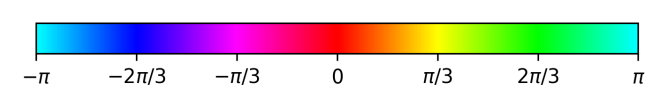

# Folders and file types

* Documentation is written in markdown.
* Tutorials are written in markdown.

# File naming conventions

* Documentation files are named using CamelCase. 
* Image files in the docs folder are named using `snake_case`

# Mathematical conventions

The imaginary unit will be denoted $\mathfrak i$, `\mathfrak i` to avoid confusion with the index $i$. 
Index symmetrization $()$ and anti-symmetrization $[]$ will be used throughout.
They are defined for an tensor $A$ with two indices by 

$$
A_{(ij)} = \frac{1}{2} (A_{ij} + A_{ji}),
$$

$$
A_{[ij]} = \frac{1}{2} (A_{ij} - A_{ji})
$$


The Fourier transform of a field $\psi$ will be denoted $\psi_{\mathfrak f}$, `\psi_{\mathfrak f}`, and is defined as 

$$
\psi_{\mathfrak f} (\mathbf k) = \int d^d r e^{-\mathfrak i \mathbf k \cdot \mathbf r} f(\mathbf r),
$$

and the inverse is given by 

$$
\psi(\mathbf r) = \frac{1}{(2\pi)^d} \int d^d k e^{\mathfrak i\mathbf k\cdot \mathbf r} \psi_{\mathfrak f}(\mathbf k),
$$

where $d$ is the spatial dimension.

Vectors $\mathbf a, \mathbf b, \mathbf c, \boldsymbol \Omega$ are denoted using boldfont (`\mathbf`, `\boldsymbol`) , while rank 2 tensors vary more. 
Typical choices however are non-bold greek letters ($\sigma$) lower case Fraktur letters ($\mathfrak h$, `\mathfrak h`) or capital letters ($Q$).

The dot product ($\cdot$) is a contraction over the last index

```math
(\nabla \cdot \sigma)_i = \partial_j {\sigma}_{ij}
```

while the double dot product $\dot \cdot$ is a contraction over the last two indices

$$
(\mathcal C \dot \cdot \mathfrak e)_ {ij} = \mathcal C_ {ijkl} \mathfrak e_ {kl}
$$

# Programming notation conventions

*  [PEP8](https://peps.python.org/pep-0008/) for python programming, and [PEP257](https://peps.python.org/pep-0257/)/[Google Python Style Guide](https://github.com/google/styleguide/blob/gh-pages/pyguide.md) for doc strings.

# Plotting conventions 

## Angle color scheme

In many of the plotting functions, we are plotting angles, for example in plotting the phase
of a complex number or the value of an order parameter on S1
. In these cases, all values
modulus 2π are eqvuivalent, but if one uses a regular color scheme, this equivalence is not
readily visible. Therefore, when expressing angles, we use the color scheme shown in Fig. 1.1.
This has the benefit of wrapping around itself at θ = ±π, stressing that these correspond


*Angle color scheme.* The color scheme follows the hsv color circle going through  $\theta=0$ (Red), $\theta=\pi/3$ (Yellow), $\theta=2\pi/3$ (Lime), $\theta = \pm \pi$ (Aqua), $\theta = -2\pi/3$ (Blue), $\theta = -\pi/3$ (Fuchsia).


## Plotting library

The standard is matplotlib.
