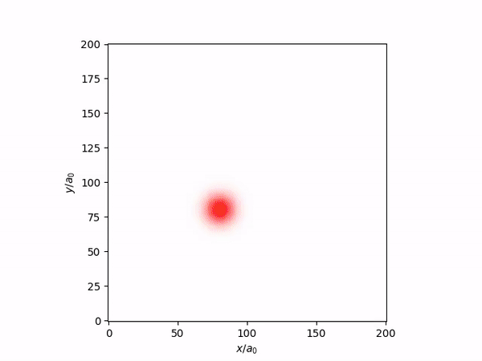

# Home

ComFiT ([github repository](https://github.com/vidarsko/ComFiT))is a versatile python library for simulating field theories, including plotting and animation in an object-oriented manner.
Below, we see the simulation of an initial Guassian wave function in a harmonic oscillator trap under the time evolution imposed by the Schrödinger equation.


*Figure: Oscillating 1D Gaussian wave packet in a harmonic oscillator* A 1D simulation of the Schrödinger equation with a Gaussian initial condition (at rest) in a Harmonic oscillator potential.



*Figure: Oscillating 2D Gaussian wave packet in a harmonic oscillator* A 2D simulation of the Schrödinger equation with a Gaussian initial condition (at rest) in a Harmonic oscillator potential.
The amplitude of the wavefunciton is shown by the color intensity (i.e., $1-\textrm{transparancy}$) and the argument by the angle color scheme (see [plotting](Plotting.md)).


*Figure: Orbiting 2D Gaussian wave packet in a harmonic oscillator* A 2D simulation of the Schrödinger equation with a Gaussian initial condition with a non-zero initial velocity in a Harmonic oscillator potential.
The amplitude of the wavefunciton is shown by the color intensity (i.e., $1-\textrm{transparancy}$) and the argument by the angle color scheme (see [plotting](Plotting.md)).


*Figure: Oscillating 3D Gaussian wave packet in a harmonic oscillator* A 3D simulation of the Schrödinger equation with a Gaussian initial condition (at rest) in a Harmonic oscillator potential.
The amplitude of the wavefunciton is shown as an isosurface at $50\%$ its maximal value and the argument by the angle color scheme (see [plotting](Plotting.md)).

The library contains a `BaseSystem` class which defines the basic parameters of a field theory, including the dimension, resolution, and generic functions.
Upon this class, one may define ones own system of interest, or experiment with the predefined systems constained in `QuantumMechanics`, `BoseEinsteinCondensate`, `NematicLiquidCrystal` or `PhaseFieldCrystal`.

For the time being, ComFiT is limited to periodic boundary conditions, but this may change in the future.

## Installation

Comfit can be installed from the Python Package Index (PyPI), a repository of software for the Python programming language, by executing the command

```bash
pip install comfit
```

pip install comfit in your terminal or command prompt.

## Virtual environnement

Using a virtual environnement when using ComFiT is highly encouraged for several reasons.

* Even though we try to write robust code, it is still a library under development, so previously written simulations may break. By keeping your simulations together with the specific version of ComFiT, you make sure that your simulations will not break due to coming updates.
* Some of the plotting functionality relies on the plotting library `mayavi`, which is very powerful, but somewhat sensitive to exactly which versions of `numpy`, `vtk` etc. are used. The compatible versions are given in the install file associated with the package and therefore, running a clean installation within a virtual environnement will make sure that ComFiT runs as wanted.

To create a virtual environnement, run the following command in your terminal after having navigated to the root folder of your exploration project

```bash
python -m venv myvenv
```

This will create the folder `myvenv` which will contain the local installation of python and associated packages.
To activate the virtual environnement, simply run

```bash
.\venv\Scripts\activate
```

from the terminal.
Afterwards, you may install ComFiT using PyPi.
If your folder is part of a github repository, it is recommended to remove the virtual environment from the git project by adding `venv/` to your `.gitignore` file.

## Custom GPT helper

We have made a custom GPT, which has been supplied with the tutorial files and example runs to help with using ComFiT.
It can be found here: [Custom GPT for help with ComFiT](https://chat.openai.com/g/g-xTFlvInYT-comfit-support).

## Contributing

We welcome contributions! Please read our [contributing guide](/docs/Contributing.md) to learn about our development process, how to propose bugfixes and improvements, and how to build and test your changes to ComFiT.
